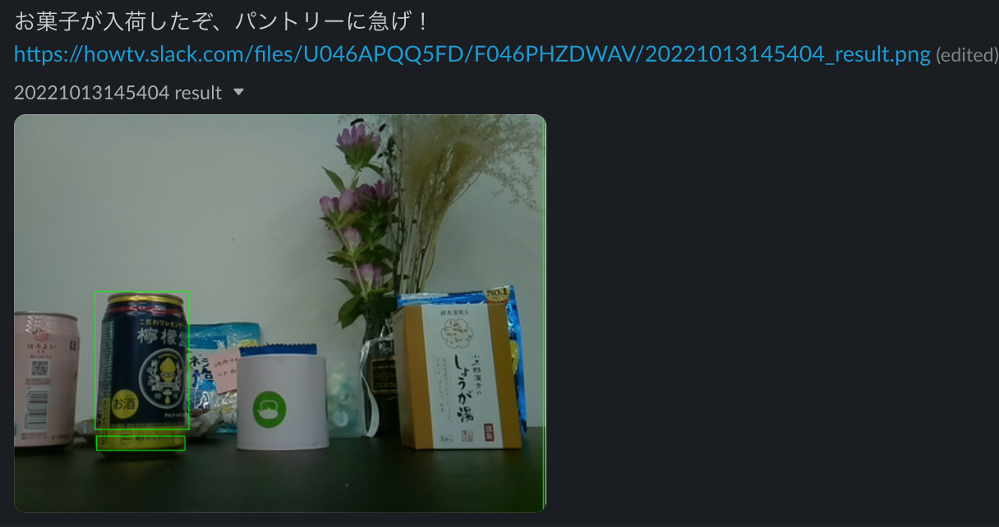

# kankichi

Notify Slack when sweets arrive!



## Requirements

The following is the environment where execution has been confirmed.

### Hardware

- Raspberry Pi 4 Model B
- Raspberry Pi Camera Module

### Software

- Python 3.7.3
- Slack

## Usage

### 1. Prepare source code.

```sh
git clone https://github.com/Doarakko/kankichi
```

### 2. Create Slack App using `manifest.yml`.

Go to [here](https://api.slack.com/apps) and create from an app manifest.

Get Bot User OAuth Token(xoxb-bbbb).

### 3. Edit `.env`.

```sh
cp .env.example .env
```

Enter `SLACK_BOT_TOKEN` and `CHANNEL_NAME`.

### 4. Install library

```sh
pip install -r requirements.txt
```

### 5. Run

```sh
python main.py
```
